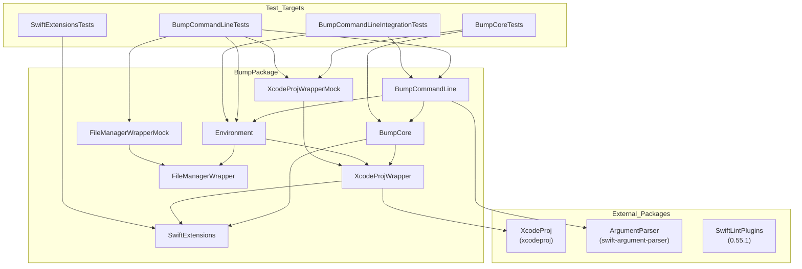

# Bump


[](https://codecov.io/gh/homerooliveira/Bump)

Command line tool for versioning your Xcode projects.

## Installation

### Requirements
- Xcode 11 

### Using [Homebrew](http://brew.sh/):
```bash
brew tap homerooliveira/Bump https://github.com/homerooliveira/Bump.git
brew install bump
```

### Compiling from source:
```bash
git clone https://github.com/homerooliveira/Bump.git
cd Bump
make install
```

## Usage

First you need set  the `Bundle versions string, short` to `$(MARKETING_VERSION)` and `Bundle version` to `$(CURRENT_PROJECT_VERSION)` in every info.plist in `target` that you want to incrementable in your project.


Now you can use bump to increment you versions, must execute the command line tool in root directory or pass the path as argument.
```bash
bump com.test.Test1 -m build -p Tests/Resources/
```
Will show to you: 
```bash
Test1 0.0.1.1 -> 0.0.1.2
```

